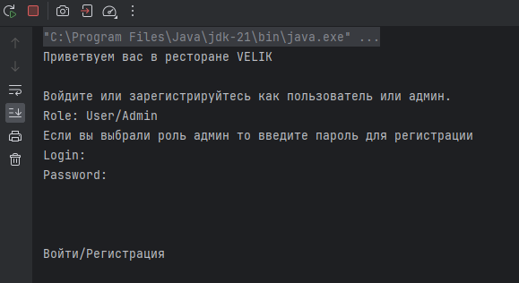
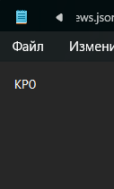

# ДЗ2
## Бакиров Даниал БПИ226
### НАЧАЛО

\
После запуска вас приветствует страница аутентификации\
Напишите "регистрация" если вы не регистрировались или "войти"

Пароль администратора задается в файле, который находится по пути files/passwordAdmin.txt\
\
По умолчанию стоит такой пароль\
\
После того как вы узнали пароль, действуйте инструкции, которая присутстсвует на экране. \
Как только вы зарегистрируйтесь, программа попросит вас войти в аккаунт. Как войдете вам будут доступны все функции.\

### Если вы выходите из меню администратора, вам нужно заново запустить программу для того чтобы войти под другим аккаунтом

## Действуйте инструкциям на экране чтобы использовать программу

